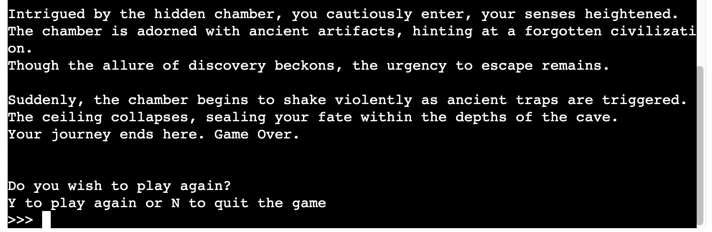
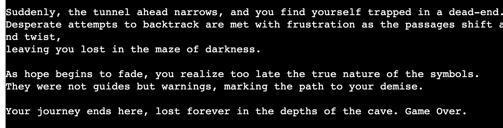
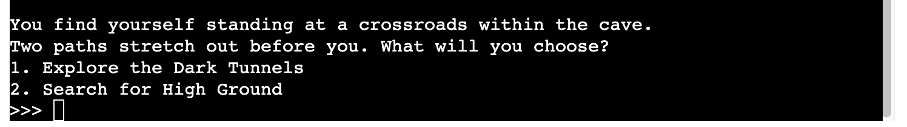
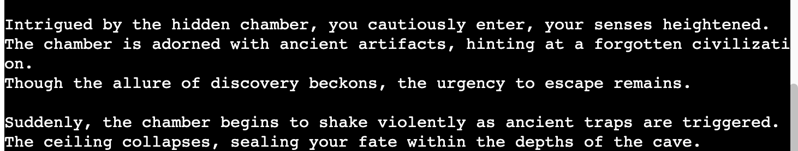

# ESCAPE from the Cave

Scape from the cave is a Python terminal game, which runs in the Code Institute mock terminal on Heroku.

Welcome to the captivating adventure of **Escape From the Cave**!

Embark on an epic RPG journey where your choices shape the course of the game. Each decision you make leads to a unique path, ensuring a thrilling and unpredictable experience.

In this gripping tale of survival, you find yourself trapped deep within a mysterious cave system. With danger lurking around every corner, you must navigate treacherous tunnels, decipher ancient markings, and overcome formidable obstacles to find your way back to safety.

But beware! The path to freedom is fraught with peril, and your every decision could mean the difference between life and death. Will you muster the courage to explore the dark unknown, or will you seek refuge in the safety of high ground?

The fate of your adventure lies in your hands. Prepare yourself for a journey of discovery, danger, and ultimate triumph as you strive to **Escape From the Cave**!

# How to Play

**Escape From the Cave** is a text-based adventure game where you must navigate through a perilous cave system and make decisions that will determine your fate. Follow these steps to embark on your journey:

1. **Starting the Game:**

    - Upon launching the game, you will be presented with an introduction to set the stage for your adventure.
    - Read through the introduction carefully to immerse yourself in the story and understand the objective of the game.

2. **Making Choices:**

    - Throughout the game, you will encounter various scenarios and choices to make.
    - Use the provided options to select your course of action. Your decisions will impact the outcome of the game.

3. **Exploring the Cave:**

    - Navigate through the dark tunnels, uncovering mysteries, and encountering challenges along the way.

4. **Reaching the End:**

    - Your goal is to successfully navigate through the cave system and find a way to escape to safety.
    - Be prepared for unexpected twists and turns as you strive to reach the end of your journey.

5. **Game Over and Victory:**

    - Depending on your choices, you may encounter a "Game Over" scenario if you fail to overcome a challenge.
    - Conversely, making the right decisions could lead you to victory, where you successfully escape from the cave.

6. **Enjoy the Adventure:**
    - Immerse yourself in the immersive world of **Escape From the Cave** and enjoy the thrill of the adventure.
    - Experiment with different choices to discover multiple paths and outcomes.

Are you ready to embark on your journey and test your wits in the depths of the cave?

# Features

**Escape From the Cave** offers an immersive and engaging gaming experience with the following features:

1. **Dynamic Storyline:**

    - Experience a gripping narrative filled with twists, turns, and unexpected challenges.
    - Your decisions shape the course of the game, leading to multiple endings and outcomes.

2. **Multiple Endings:**

    - Explore different paths and make crucial choices that impact the ending of the game.
    - Discover a variety of outcomes based on your actions and decisions throughout the adventure.

    

    

    

3. **Interactive Gameplay:**

    - Engage with the game through text-based interactions and decision-making.
    - Choose your responses carefully to progress through the story and overcome obstacles.

    

4. **Exploration and Discovery:**

    - Navigate through intricate cave systems filled with hidden chambers, ancient artifacts, and perilous traps.

    

5. **Immersive Atmosphere:**

    - Immerse yourself in the atmospheric world of the cave with descriptive text
    - Experience the tension, excitement, and danger of exploring unknown territories.

6. **Replayability:**

    - Replay the game to explore different storylines, make alternate choices, and uncover hidden secrets.
    - Discover new paths, endings, and outcomes with each playthrough.

# Testing

## Overview

The "Escape From the Cave" project requires comprehensive testing to ensure that all game mechanics, features, and interactions function as intended. Testing will cover various aspects of the game, including gameplay, functionality and performance.

## Testing Objectives

1. **Functional Testing:**

    - Verify that all game features, including navigation, choices, and interactions, work correctly.
    - Test each game scenario to ensure that choices lead to appropriate consequences and outcomes.

2. **User Interface Testing:**

    - Evaluate the user interface for clarity, consistency, and ease of use.
    - Test dialogue boxes, and interactive elements to ensure smooth user interaction.

3. **Regression Testing:**

    - Perform regression testing to verify that recent code changes or updates have not introduced new bugs or regressions.
    - Re-test previously validated features and functionalities to ensure ongoing stability and reliability.

4. **PEP8**
    - PEP8 website is offline and couldn't check for it.

## Bugs

### Solved Bugs

-   When I was trying to deploy the project in the Heroku website, I was getting a error and I couldn't finish the deploy. After few searches in Google, I found the problem in the dependencies of `requirements.txt`

## Remaining Bugs

-   No bugs remaining

# Deployment

The site was deployed to Heroku pages. The steps to deploy are as follows:

1. Log in to Heroku.
2. Click 'New' and select 'Create new app'.
3. Choose a name for the app, region, and click on 'Create app'.
4. Only 'Deploy' and 'Settings' are relevant from the menu section. Starting with the 'Settings' first.
5. Now Buildpacks need to be added. They install future dependencies that are needed outside of the requirements file. The first is Python and the second is node.js. Python needs to be selected first and then node.js. Save this selection.
6. Now the 'Deploy' section needs to be selected from the menu and connect it to GitHub.
7. Enter the name of the repository we want to connect it with and click 'Connect'.
8. The choice appears now to either deploy using automatic deploys or manual deployment, which deploys the current state of the branch.
9. Click deploy branch.

How to run the program:

To start the program again, the user must return to the beginning where it says "RUN PROGRAM" and click with the right mouse button or refresh the page.

To run a backend Python file, type `python3 app.py`, if your Python file is named `app.py` of course.

# Credits

-   Code Institute for the deployment terminal
-   Google for ideas the story for the project
